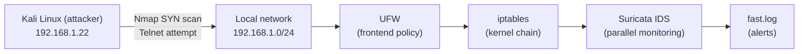

# Firewall Hardening & Intrusion Detection Lab (UFW + iptables + Suricata)

A hands-on network security lab demonstrating **defense in depth**: a deny-by-default firewall policy built with UFW/iptables, paired with a **Network Intrusion Detection System (NIDS)** using Suricata to detect and log attack attempts in real time.

Attacks were simulated from a separate attacker machine using **Nmap TCP SYN scanning** and a **Telnet connection attempt**, then analyzed based on the resulting IDS alert logs.

---

## Table of contents

- [Overview](#overview)
- [Lab architecture](#lab-architecture)
- [Firewall configuration](#firewall-configuration)
- [Attack simulation](#attack-simulation)
- [IDS detection results](#ids-detection-results)
- [Analysis](#analysis)
- [Repository structure](#repository-structure)
- [How to reproduce](#how-to-reproduce)
- [What I learned](#what-i-learned)

---

## Overview

| Component | Detail |
|---|---|
| Target (server) | Ubuntu, `192.168.1.16` |
| Attacker | Kali Linux, `192.168.1.22` |
| Firewall | UFW (frontend) + iptables (kernel) |
| IDS | Suricata, custom rules |
| Attack techniques | Nmap TCP SYN scan, Telnet connection attempt |
| Outcome | Both attacks detected and logged; malicious connections blocked by the firewall |

---

## Lab architecture

The attacker sits on the same local network as the target. Traffic from the attacker must pass through UFW first, then gets forwarded to the kernel-level `iptables` chain, while Suricata runs in parallel, monitoring all traffic in and out of the network interface.



> The diagram above renders automatically on GitHub (Mermaid). If viewed in an editor without Mermaid support, see the screenshots in the [`screenshots/`](./screenshots) folder instead.

---

## Firewall configuration

### 1. UFW (Uncomplicated Firewall)

Policy applied:

- **Rate limiting** on SSH (22/tcp) to mitigate brute-force attempts.
- **Allow** public services: HTTP (80/tcp), HTTPS (443/tcp).
- **Explicit deny** on high-risk ports:

```
22/tcp    LIMIT IN   # Rate limit SSH
80/tcp    ALLOW IN   # Allow HTTP
443/tcp   ALLOW IN   # Allow HTTPS
23/tcp    DENY IN    # Block Telnet
21/tcp    DENY IN    # Block FTP
3389/tcp  DENY IN    # Block RDP
137/udp   DENY IN    # Block NetBIOS
138/udp   DENY IN    # Block NetBIOS
139/tcp   DENY IN    # Block NetBIOS
445/tcp   DENY IN    # Block SMB
3306/tcp  DENY IN    # Block MySQL External
4444/tcp  DENY IN    # Block Metasploit default
5555/tcp  DENY IN    # Block reverse shell common
```

The same rules are mirrored for IPv6.

<details>
<summary><b>📷 View full <code>ufw status numbered</code> output</b></summary>


</details>

### 2. Kernel-level verification (iptables)

```bash
sudo iptables -L -v -n --line-numbers
```

Verification confirms the default policies:

| Chain | Default policy |
|---|---|
| `INPUT` | `DROP` |
| `FORWARD` | `DROP` |
| `OUTPUT` | `ACCEPT` |

This is consistent with a **deny-by-default** approach: all inbound traffic is dropped unless explicitly allowed by the UFW rules above.

<details>
<summary><b>📷 View full <code>iptables -L -v -n</code> output</b></summary>


</details>

---

## Attack simulation

Attacks were launched from the Kali Linux machine (`192.168.1.22`) to test the effectiveness of the firewall and IDS.

### 1. Port scanning (Nmap TCP SYN scan)

```bash
nmap -sS -Pn -p 1-1000 192.168.1.16
```

```
PORT     STATE    SERVICE
22/tcp   open     ssh
80/tcp   open     http
443/tcp  closed   https

Nmap done: 1 IP address (1 host up) scanned in 5.52 seconds
```

### 2. Telnet connection attempt

```bash
telnet 192.168.1.16 23
```

```
Trying 192.168.1.16...
```
*(hangs with no response — the connection was blocked by the firewall on the target side)*

<details>
<summary><b>📷 View full screenshot from the attacker's side</b></summary>


</details>

---

## IDS detection results

Alert logs were monitored in real time on the target side:

```bash
sudo tail -f /var/log/suricata/fast.log
```

<details>
<summary><b>📷 View real-time Suricata log screenshot</b></summary>


</details>

### Alert summary by category

| Time | Attack type | SID | Priority | Source → Destination |
|---|---|---|---|---|
| 22:33:37 | Nmap TCP SYN Scan | `1:1000006:1` | 2 | `192.168.1.22` → `192.168.1.16` |
| 22:34:29 – 22:34:40 | Telnet Connection Attempt | `1:1000005:1` | 1 | `192.168.1.22:33886` → `192.168.1.16:23` |
| 22:33:37 | Spotify P2P Client *(non-attack)* | `1:2027397:1` | 3 | `192.168.1.8` → broadcast |

The full log and category summary are available at:
- [`logs/output_ids_alerts.txt`](./logs/output_ids_alerts.txt) — raw alert log
- [`logs/output_ids_summary.txt`](./logs/output_ids_summary.txt) — summary by category

---

## Analysis

### Nmap TCP SYN Scan

The IDS detected a pattern of **many SYN packets sent to multiple destination ports within an extremely short time window** (consecutive alerts only ~0.1 seconds apart) from a single source IP. This is the signature behavior of a *half-open scan* (`nmap -sS`), where the attacker sends SYN packets without completing the *three-way handshake*, allowing port status to be probed quickly and relatively quietly.

### Telnet Connection Attempt

The IDS flagged every TCP connection attempt to **port 23** (the standard Telnet port). Because Telnet transmits data — including login credentials — in **plaintext**, every connection attempt to this port is marked as a potential privacy/security violation with the highest priority, even though the firewall on the target had already blocked the port so the connection never actually completed.

### Spotify P2P Client (benign traffic)

One low-priority alert (priority 3, "Not Suspicious Traffic") shows that Suricata's signature-based rules can **distinguish ordinary background traffic** from traffic that genuinely indicates an attack — proof that the IDS doesn't just detect threats, but also classifies their severity.

### Conclusion

- **Firewall (prevention)** and **IDS (detection + logging)** complement each other: the firewall prevents malicious connections from ever completing, while the IDS still logs the attempt as forensic evidence.
- A **deny-by-default** policy on the `INPUT`/`FORWARD` chains effectively blocks high-risk ports without disrupting needed services (HTTP/HTTPS).
- Pattern-based (not just port-based) custom Suricata rules enable detection of relatively stealthy scanning techniques like SYN scans.

---

## Repository structure

```
.
├── README.md
├── logs/
│   ├── output_ids_alerts.txt      # Full raw Suricata alert log
│   └── output_ids_summary.txt     # Alert summary by category
└── screenshots/
    ├── ufw-status.png
    ├── iptables-output.png
    ├── nmap-telnet-attacker.png
    └── suricata-log.png
```

---

## How to reproduce

> ⚠️ Run this only on a network/lab you own. Scanning or exploiting systems you don't have permission to test is illegal.

1. **Set up two VMs** (or two hosts) on the same local network — one as the target (Ubuntu), one as the attacker (Kali Linux).
2. **Configure UFW** on the target according to the table in [Firewall configuration](#firewall-configuration), then enable it: `sudo ufw enable`.
3. **Install and run Suricata** on the target, point it to the active network interface, and write custom rules to detect SYN scans and Telnet connection attempts.
4. **Run the simulated attacks** from the attacker machine using the commands in [Attack simulation](#attack-simulation).
5. **Monitor the logs** with `sudo tail -f /var/log/suricata/fast.log` on the target and observe the resulting alerts.

---

## What I learned

- Writing and applying layered firewall policy (UFW as the frontend, iptables as the kernel-level enforcement layer).
- Writing custom Suricata rules based on traffic patterns, not just port matching.
- Reading and interpreting IDS logs for basic forensics: identifying the attack source, timing, and technique used.
- Understanding how firewalls and IDS act as two complementary layers of defense (*prevention* vs. *detection*).

---

*This lab was built as part of a network security coursework assignment.*
